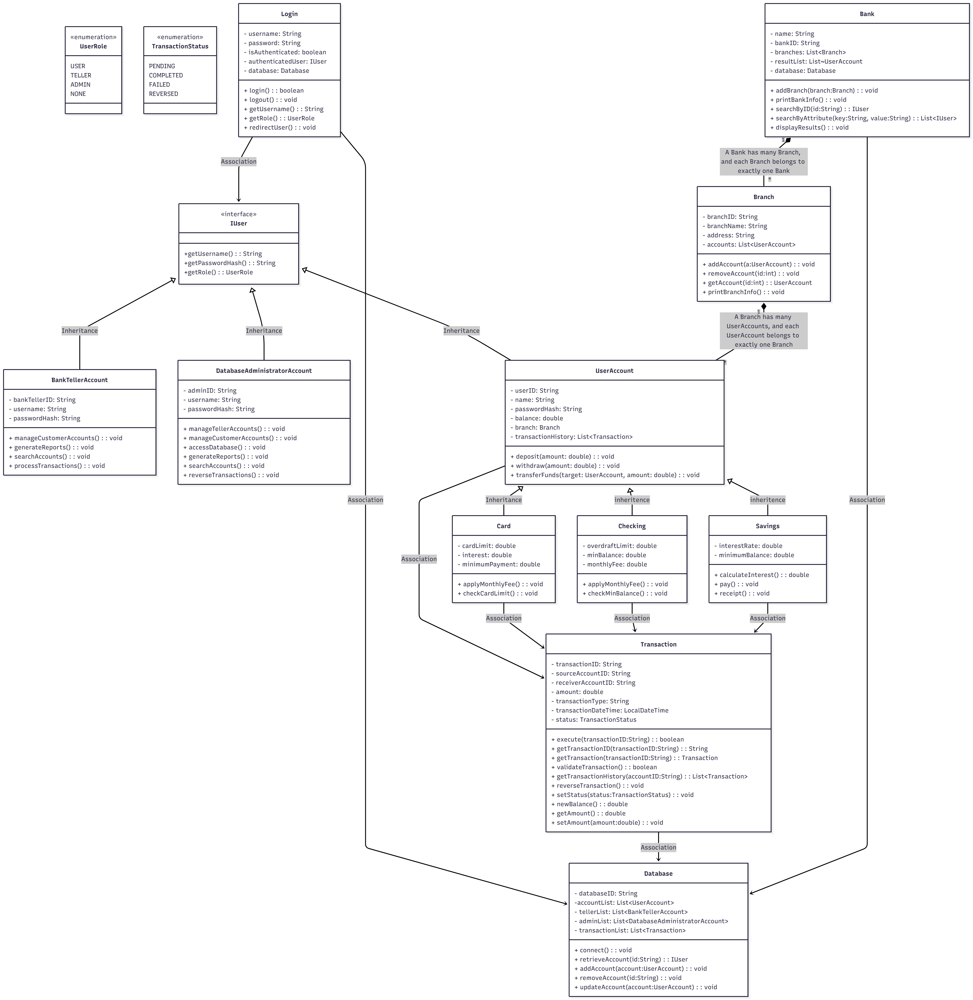

# 🏦 MyBankUML: Banking System Implementation

Welcome to **MyBankUML**, a Java-based banking application designed to simulate core banking operations such as account management, transactions, user authentication, and branch-level banking logic.  

This project is implemented **strictly according to the provided UML diagram**, following strong Object-Oriented Programming (OOP) principles such as **Inheritance**, **Encapsulation**, **Abstraction**, and **Polymorphism**.

---

## 📌 Features

- **UML-Driven Design**  
  Every class, attribute, and method is implemented exactly as shown in the UML diagram — nothing more, nothing less.

- **User Roles**  
  Supports Customers (`UserAccount`), Tellers (`BankTellerAccount`), and Administrators (`DatabaseAdministratorAccount`).

- **Account Types**  
  Checking, Savings, and Card accounts with their own properties and operations.

- **Transaction Processing**  
  Execute and reverse transactions, check limits, apply fees, and generate reports.

- **Bank + Branch System**  
  Branch-level account management and multi-criteria searching.

- **Database Integration**  
  MongoDB is used internally to store Users, Tellers, Admins, and Transactions — fully hidden behind the UML `Database` interface.

---

## 🧩 UML Class Diagram

The entire project structure follows the UML below:



> All implementation work by team members must follow this UML exactly.

---

## 📁 Project Structure

```text
MyBankUML/
├── README.md
├── .gitignore
├── docs/.       – Assignment PDFs, UML diagrams, design notes
│  
│  
│  
├── backend/
│       ├── main
│       │   ├── application/          # Login, App entry point
│       │   ├── domain/
│       │      ├── enums/            # UserRole, TransactionStatus
│       │      ├── users/            # IUser, UserAccount, Teller, Admin
│       │      ├── accounts/         # Checking, Savings, Card
│       │      ├── bank/             # Bank, Branch
│       │      ├── transactions/     # Transaction
│       │      └── database/         # Database (MongoDB-backed)
│       └── test/ # Unit tests for each module  
|
├── frontend/
│ 
├── db/.          -MongoDB configuration notes and seed data
│  
│   
└── scripts/.   -Helper scripts (build, run, etc.)
```
---
## Branching Strategy

- `main` – final, stable submission-ready code.
- `develop` – integration branch; all feature branches merge here.
- `feature/<module-name>` – one per module (e.g., `feature/alisa-teller-module`).

Workflow for contributors:

```bash
git checkout develop
git pull
git checkout -b feature/<module-name>
# implement your UML classes
git add .
git commit -m "Implement <module> based on UML"
git push origin feature/<module-name>
# open a Merge Request into develop